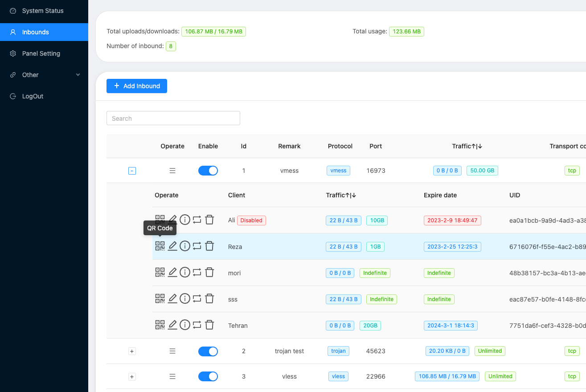
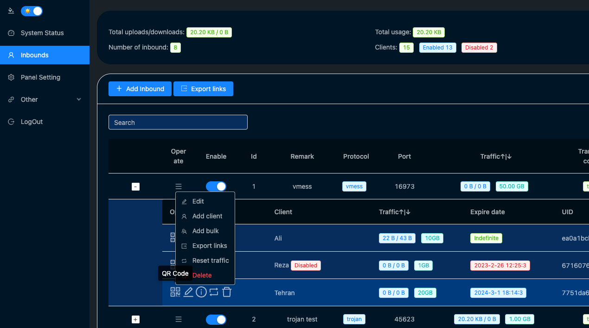
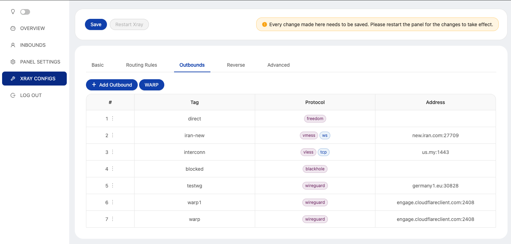
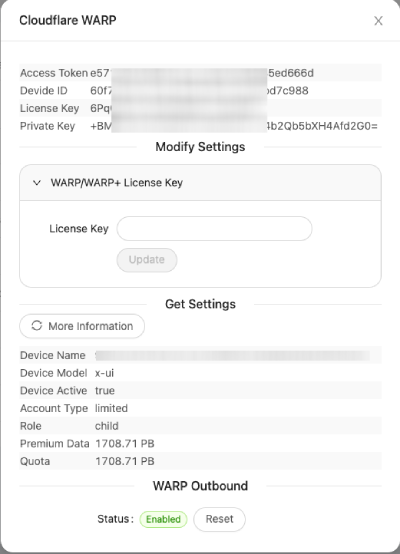

# X-UI
**An Advanced Web Panel • Built on Xray Core**


[](https://goreportcard.com/report/github.com/alireza0/x-ui)
[](https://img.shields.io/github/downloads/alireza0/x-ui/total.svg)
[](https://www.gnu.org/licenses/gpl-3.0.en.html)

> **Disclaimer:** This project is only for personal learning and communication, please do not use it for illegal purposes, please do not use it in a production environment

**If you think this project is helpful to you, you may wish to give a**:star2:


- USDT (TRC20): `TYTq73Gj6dJ67qe58JVPD9zpjW2cc9XgVz`
- Tezos (XTZ):
`tz2Wnh2SsY1eezXrcLChu6idWpgdHzUFQcts`


## Quick Overview
| Features                               |      Enable?       |
| -------------------------------------- | :----------------: |
| Multi-Protocol                         | :heavy_check_mark: |
| Multi-Language                         | :heavy_check_mark: |
| Multi-Client/Inbound                   | :heavy_check_mark: |
| Advanced Traffic Routing Interface     | :heavy_check_mark: |
| Client & Traffic & System Status       | :heavy_check_mark: |
| Date & Traffic Cap Based on First Use  | :heavy_check_mark: |
| REST API                               | :heavy_check_mark: |
| TG Bot (DB backup + admin + client)    | :heavy_check_mark: |
| Subscription Service (link + info)     | :heavy_check_mark: |
| Search in Deep                         | :heavy_check_mark: |
| Dark/Light Theme                       | :heavy_check_mark: |

  
## Install & Upgrade to Latest Version

```sh
bash <(curl -Ls https://raw.githubusercontent.com/alireza0/x-ui/master/install.sh)
```

## Install Custom Version

**Step 1:** To install your desired version, add the version to the end of the installation command. e.g., ver `1.7.1`:

```sh
bash <(curl -Ls https://raw.githubusercontent.com/alireza0/x-ui/master/install.sh) 1.7.1
```

## Manual Install & Upgrade

<details>
  <summary>Click for details</summary>
  
### Usage

1. To download the latest version of the compressed package directly to your server, run the following command:

```sh
ARCH=$(uname -m)
case "${ARCH}" in
  x86_64 | x64 | amd64) XUI_ARCH="amd64" ;;
  i*86 | x86) XUI_ARCH="386" ;;
  armv8* | armv8 | arm64 | aarch64) XUI_ARCH="arm64" ;;
  armv7* | armv7) XUI_ARCH="armv7" ;;
  *) XUI_ARCH="amd64" ;;
esac

wget https://github.com/alireza0/x-ui/releases/latest/download/x-ui-linux-${XUI_ARCH}.tar.gz
```

2. Once the compressed package is downloaded, execute the following commands to install or upgrade x-ui:

```sh
ARCH=$(uname -m)
case "${ARCH}" in
  x86_64 | x64 | amd64) XUI_ARCH="amd64" ;;
  i*86 | x86) XUI_ARCH="386" ;;
  armv8* | armv8 | arm64 | aarch64) XUI_ARCH="arm64" ;;
  armv7* | armv7) XUI_ARCH="armv7" ;;
  *) XUI_ARCH="amd64" ;;
esac
cd /root/
rm x-ui/ /usr/local/x-ui/ /usr/bin/x-ui -rf
tar zxvf x-ui-linux-${XUI_ARCH}.tar.gz
chmod +x x-ui/x-ui x-ui/bin/xray-linux-* x-ui/x-ui.sh
cp x-ui/x-ui.sh /usr/bin/x-ui
cp -f x-ui/x-ui.service /etc/systemd/system/
mv x-ui/ /usr/local/
systemctl daemon-reload
systemctl enable x-ui
systemctl restart x-ui
```

</details>

## Install using Docker

<details>
   <summary>Click for details</summary>

### Usage

**Step 1:** Install Docker

```shell
curl -fsSL https://get.docker.com | sh
```

**Step 2:** Clone the Project Repository:

   ```sh
   git clone https://github.com/alireza0/x-ui.git
   cd x-ui
   ```

**Step 3:** Start the Service

   ```sh
   docker compose up -d
   ```

   OR

```shell
mkdir x-ui && cd x-ui
docker run -itd \
    -p 54321:54321 -p 443:443 -p 80:80 \
    -e XRAY_VMESS_AEAD_FORCED=false \
    -v $PWD/db/:/etc/x-ui/ \
    -v $PWD/cert/:/root/cert/ \
    --name x-ui --restart=unless-stopped \
    alireza7/x-ui:latest
```

update to latest version

   ```sh
    cd x-ui
    docker compose down
    docker compose pull x-ui
    docker compose up -d
   ```

remove x-ui from docker 

   ```sh
    docker stop x-ui
    docker rm x-ui
    cd --
    rm -r x-ui
   ```

> Build your own image

```shell
docker build -t x-ui .
```

</details>

## Languages

- English
- Chinese
- Farsi
- Russian
- Vietnamese

## Features

- Supports protocols including VLESS, VMess, Trojan, Shadowsocks, Dokodemo-door, SOCKS, HTTP, Wireguard
- Supports XTLS protocols, including Vision and REALITY
- An advanced interface for routing traffic, incorporating PROXY Protocol, Reverse, External, and Transparent Proxy, along with Multi-Domain, SSL Certificate, and Port
- Support auto generate Cloudflare WARP using Wireguard outbound
- An interactive JSON interface for Xray template configuration
- An advanced interface for inbound and outbound configuration
- Clients’ traffic cap and expiration date based on first use
- Displays online clients, traffic statistics, and system status monitoring
- Deep database search
- Displays depleted clients with expired dates or exceeded traffic cap
- Subscription service with (multi)link
- Importing and exporting databases
- One-Click SSL certificate application and automatic renewal
- HTTPS for secure access to the web panel and subscription service (self-provided domain + SSL certificate)
- Dark/Light theme

## Recommended OS

- CentOS 8+
- Ubuntu 20+
- Debian 10+
- Fedora 36+

## Preview








## API Routes

<details>
  <summary>Click for details</summary>

### Usage

- `/login` with `PUSH` user data: `{username: '', password: ''}` for login
- `/xui/API/inbounds` base for following actions:

| Method | Path                               | Action                                    |
| :----: | ---------------------------------  | ----------------------------------------- |
| `GET`  | `"/"`                              | Get all inbounds                          |
| `GET`  | `"/get/:id"`                       | Get inbound with inbound.id               |
| `GET`  | `"/createbackup"`                  | Telegram bot sends backup to admins       |
| `POST` | `"/add"`                           | Add inbound                               |
| `POST` | `"/del/:id"`                       | Delete inbound                            |
| `POST` | `"/update/:id"`                    | Update inbound                            |
| `POST` | `"/addClient/"`                    | Add client to inbound                     |
| `POST` | `"/:id/delClient/:clientId"`       | Delete client by clientId\*               |
| `POST` | `"/updateClient/:clientId"`        | Update client by clientId\*               |
| `GET`  | `"/getClientTraffics/:email"`      | Get client's traffic                      |
| `POST` | `"/:id/resetClientTraffic/:email"` | Reset client's traffic                    |
| `POST` | `"/resetAllTraffics"`              | Reset traffics of all inbounds            |
| `POST` | `"/resetAllClientTraffics/:id"`    | Reset inbound clients traffics (-1: all)  |
| `POST` | `"/delDepletedClients/:id"`        | Delete inbound depleted clients (-1: all) |
| `POST` | `"/onlines"`                       | Get online users ( list of emails )       |

\*- The field `clientId` should be filled by:

- `client.id` for VMess and VLESS
- `client.password` for Trojan
- `client.email` for Shadowsocks

</details>

## Environment Variables

<details>
  <summary>Click for details</summary>

### Usage

| Variable       |                      Type                      | Default       |
| -------------- | :--------------------------------------------: | :------------ |
| XUI_LOG_LEVEL  | `"debug"` \| `"info"` \| `"warn"` \| `"error"` | `"info"`      |
| XUI_DEBUG      |                   `boolean`                    | `false`       |
| XUI_BIN_FOLDER |                    `string`                    | `"bin"`       |
| XUI_DB_FOLDER  |                    `string`                    | `"/etc/x-ui"` |

</details>

## SSL Certificate

<details>
  <summary>Click for details</summary>

### Cloudflare 

The admin management script has a built-in SSL certificate application for Cloudflare. To use this script to apply for a certificate, you need the following:

- Cloudflare registered email
- Cloudflare Global API Key
- The domain name has been resolved to the current server through cloudflare

**Step 1:** Run the`x-ui`command on the server's terminal and then choose `17`. Then enter the information as requested.


### Certbot

```bash
snap install core; snap refresh core
snap install --classic certbot
ln -s /snap/bin/certbot /usr/bin/certbot

certbot certonly --standalone --register-unsafely-without-email --non-interactive --agree-tos -d <Your Domain Name>
```

</details>

## Telegram Bot

<details>
  <summary>Click for details</summary>

### Usage

The web panel supports daily traffic, panel login, database backup, system status, client info, and other notification and functions through the Telegram Bot. To use the bot, you need to set the bot-related parameters in the panel, including:

- Telegram Token
- Admin Chat ID(s)
- Notification Time (in cron syntax)
- Database Backup
- CPU Load Threshold Notification

**Crontab Time Format**

Reference syntax:

- `*/30 * * * *` - Notify every 30 minutes, every hour
- `30 * * * * *` - Notify at the 30th second of each minute
- `0 */10 * * * *` - Notify at the start of every 10 minutes
- `@hourly` - Hourly notification
- `@daily` - Daily notification (00:00 AM)
- `@every 8h` - Notify every 8 hours

For more info about [Crontab](https://acquia.my.site.com/s/article/360004224494-Cron-time-string-format)

### Features

- Periodic reporting
- Login notifications
- CPU load threshold notifications
- Advance notifications for expiration time and traffic
- Client reporting menu with Telegram ID or username in configurations
- Anonymous traffic reports, search by UUID (VLESS/VMess) or Password (Trojan/Shadowsocks)
- Menu-based bot
- Client search by email (admin only)
- Inbound checks
- System status check
- Depleted client checks
- Backup on request and in periodic reports
- Multilingual support
</details>

## Troubleshoots

<details>
  <summary>Click for details</summary>

### Enable Traffic Usage

If you are upgrading from an older version or other forks and find that data traffic usage for clients may not work by default, follow the steps below to enable it:

**Step 1: Locate the Configuration Section**

Find the following section in the config file:

```json
  "policy": {
    "system": {
      // Other policy configurations
    }
  },
```
**Step 2: Add the Required Configuration**

Add the following section just after `"policy": {`:

```json
"levels": {
  "0": {
    "statsUserUplink": true,
    "statsUserDownlink": true
  }
},
```
**Step 3: Final Configuration**

Your final config should look like this:

```json
"policy": {
  "levels": {
    "0": {
      "statsUserUplink": true,
      "statsUserDownlink": true
    }
  },
  "system": {
    "statsInboundDownlink": true,
    "statsInboundUplink": true
  }
},
"routing": {
  // Other routing configurations
},
```
**Step 4: Save and Restart**

Save your changes and restart the Xray Service
</details>

## A Special Thanks to

- [HexaSoftwareTech](https://github.com/HexaSoftwareTech/)
- [MHSanaei](https://github.com/MHSanaei)

## Acknowledgment

- [Loyalsoldier](https://github.com/Loyalsoldier/v2ray-rules-dat) (License: **GPL-3.0**): _The enhanced version of V2Ray routing rule._
- [Iran v2ray rules](https://github.com/chocolate4u/Iran-v2ray-rules) (License: **GPL-3.0**): _Enhanced v2ray/xray and v2ray/xray-clients routing rules with built-in Iranian domains and a focus on security and adblocking._

## Stargazers over Time

[](https://starchart.cc/alireza0/x-ui)
